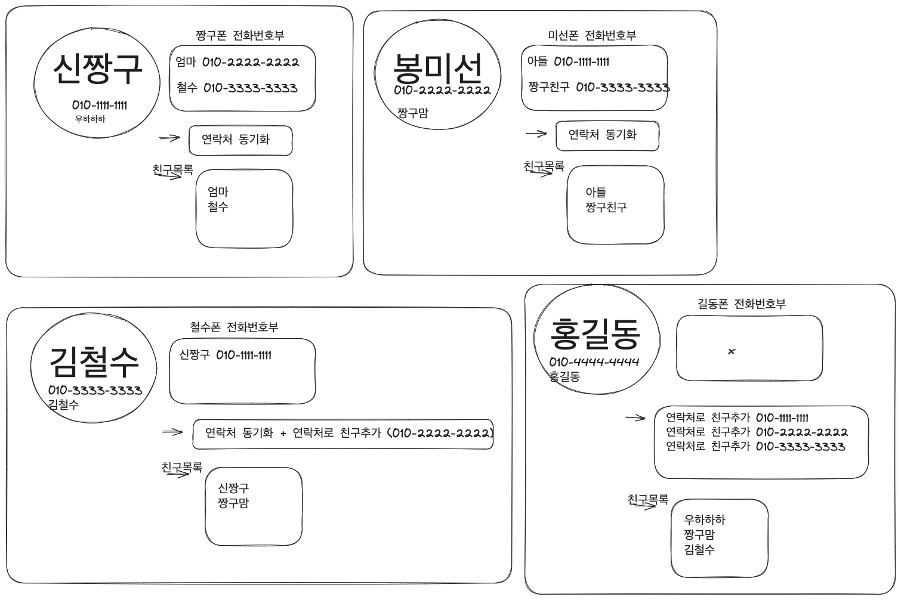

# 네임이냐 닉네임이냐 그것이 문제로다.

### 상태

진행중

### 내용

#### 2023.06.01

- profile 등록시 이름을 받을것인가 닉네임을 받을 것인가.
- 이름
	- 연락처 기반의 어플 -> 이름을 사용하자.

- 닉네임
	- 연락처 기반의 메신져 앱에서 이름을 사용하는것은 `nickname` 을 `이름(본명)`으로 사용한경우라고 생각
	- 연락처를 알고/공유한다고 해서 그 사람의 이름을 알고 있는것은 다른 관점이라고 생각
		- 따라서 이경우 연락처만 알고 이름을 모르는 경우 `아발론챗` 을 통해 원치 않게 `이름(본명)` 이 노출될 수 있음
		- 물론 자기 닉네임을 일반적으로 본명으로 설정한 경우는 사용하자 이를 감수한것임

	- 결국 이런 이유로 nickname 이라는 개념이 필요하다고 생각함
	- 그래서 이름(본명)을 추가하는 것은 좋지만 이게 친구목록에 표시되는 `friendName` 로서 사용되는것은 이상하다고 생각함
	- 연락처 동기화 기능을 통해 해당 사용자가 자신의 전화번호부에 대상 친구의 이름을 별도로 저장한 경우 대상 사용자의 저장한 이름을 사용하고 그렇지 않다면 자신이 설정한 nickname 을 보여주자!

### 결론

TBD